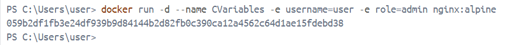
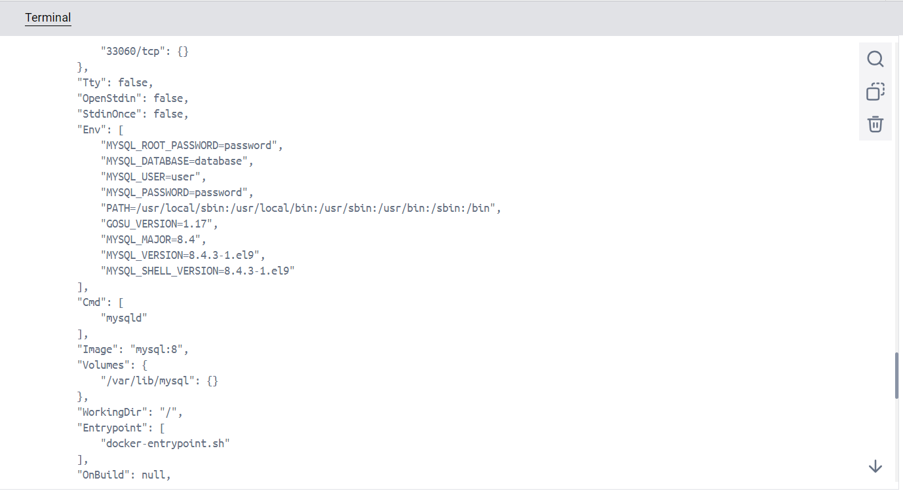
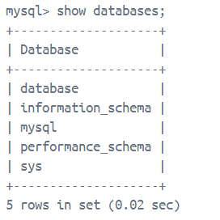

# Variables de Entorno
### ¿Qué son las variables de entorno
Son variables dinámicas que pueden cambiarse en función del entorno en el que se ejecuta un programa. Estas variables contienen información que los programas y servicios pueden utilizar para conocer detalles sobre el sistema o para configurar su propio comportamiento.

### Para crear un contenedor con variables de entorno?

```
docker run -d --name <nombre contenedor> -e <nombre variable1>=<valor1> -e <nombre variable2>=<valor2>
```

### Crear un contenedor a partir de la imagen de nginx:alpine con las siguientes variables de entorno: username y role. Para la variable de entorno rol asignar el valor admin.
```
docker run -d --name CVariables -e username=user -e role=admin nginx:alpine
```


### Crear un contenedor con mysql:8 , mapear todos los puertos
```
docker run -d --name Cmysql -e MYSQL_ROOT_PASSWORD=password -p 3307:3306 mysql:8

```

### ¿El contenedor se está ejecutando?
El contenedor Cmysql si se está ejecutando, se puede verificar usando el comando docker ps, que muestra el estado 'Up', lo que indica que MySQL está activo y funcionando dentro del contenedor.

### Identificar el problema
Algunos archivos no se están cargando por completo y se saltan.

### Eliminar el contenedor creado con mysql:8 
```
docker rm Cmysql
```

### Para crear un contenedor con variables de entorno especificadas
- Portabilidad: Las aplicaciones se vuelven más portátiles y pueden ser desplegadas en diferentes entornos (desarrollo, pruebas, producción) simplemente cambiando el archivo de variables de entorno.
- Centralización: Todas las configuraciones importantes se centralizan en un solo lugar, lo que facilita la gestión y auditoría de las configuraciones.
- Consistencia: Asegura que todos los miembros del equipo de desarrollo o los entornos de despliegue utilicen las mismas configuraciones.
- Evitar Exposición en el Código: Mantener variables sensibles como contraseñas, claves API, y tokens fuera del código fuente reduce el riesgo de exposición accidental a través del control de versiones.
- Control de Acceso: Los archivos de variables de entorno pueden ser gestionados con permisos específicos, limitando quién puede ver o modificar la configuración sensible.

Previo a esto es necesario crear el archivo y colocar las variables en un archivo, **.env** se ha convertido en una convención estándar, pero también es posible usar cualquier extensión como **.txt**.
```
docker run -d --name <nombre contenedor> --env-file=<nombreArchivo>.<extensión> <nombre imagen>
```
**Considerar**
Es necesario especificar la ruta absoluta del archivo si este se encuentra en una ubicación diferente a la que estás ejecutando el comando docker run.

### Crear un contenedor con mysql:8 , mapear todos los puertos y configurar las variables de entorno mediante un archivo
```
docker run -d --name mysql_container --env-file=mysql.txt -p 3307:3306 mysql:8
```

# CAPTURA CON LA COMPROBACIÓN DE LA CREACIÓN DE LAS VARIABLES DE ENTORNO DEL CONTENEDOR ANTERIOR 


### ¿Qué bases de datos existen en el contenedor creado?
Las bases de datos existentes son information_schema, mysql, performance_schema y sys del sistema que MySQL crea por defecto, database es la base de datos que se creó mediante las variables de entorno.

