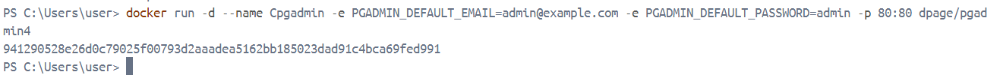

### Crear contenedor de Postgres sin que exponga los puertos. Usar la imagen: postgres:11.21-alpine3.17
# COMPLETAR
```
docker run -d --name Cpostgres -e POSTGRES_PASSWORD=password postgres:11.21-alpine3.17
```


### Crear un cliente de postgres. Usar la imagen: dpage/pgadmin4
```
docker run -d --name Cpostgres -e PGADMIN_DEFAULT_EMAIL=admin@example.com -e PGADMIN_DEFAULT_PASSWORD=admin -p 80:80 dpage/pgadmin4

```


La figura presenta el esquema creado en donde los puertos son:
- a: (completar con el valor)
- b: (completar con el valor)
- c: (completar con el valor)


## Desde el cliente
### Acceder desde el cliente al servidor postgres creado.


### Crear la base de datos info, y dentro de esa base la tabla personas, con id (serial) y nombre (varchar), agregar un par de registros en la tabla, obligatorio incluir su nombre.
```
docker exec -it Cpostgres psql -U postgres 
psql (11.21)
Type "help" for help.

postgres=# CREATE DATABASE info;
CREATE DATABASE
postgres=# \c info
You are now connected to database "info" as user "postgres".
info=# CREATE TABLE personas (
info(#     id SERIAL PRIMARY KEY,
info(#     nombre VARCHAR(100)
info(# );
CREATE TABLE
info=# INSERT INTO personas (nombre) VALUES ('Martin'); 
INSERT 0 1
info=# INSERT INTO personas (nombre) VALUES ('Damaris');
INSERT 0 1
info=# SELECT * FROM personas;

```
## Desde el servidor postgresl
### Acceder al servidor
```
docker exec -it Cpostgres psql -U postgres 
```
### Conectarse a la base de datos info
```
postgres=# \c info
```

### Realizar un select *from personas

