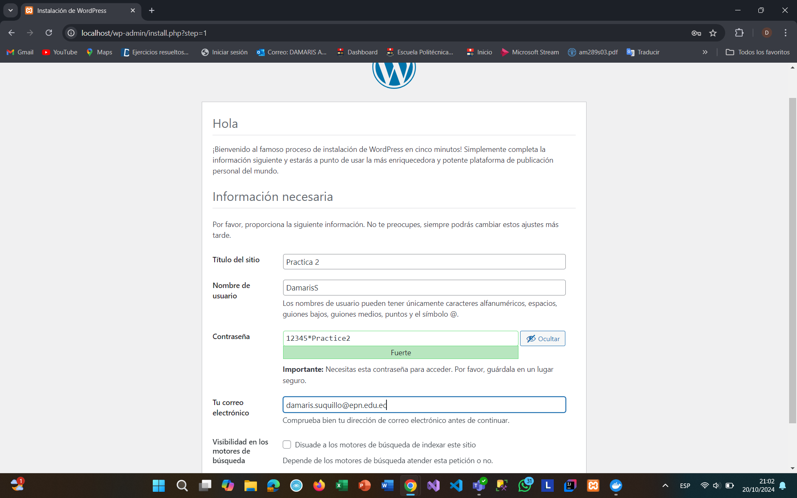
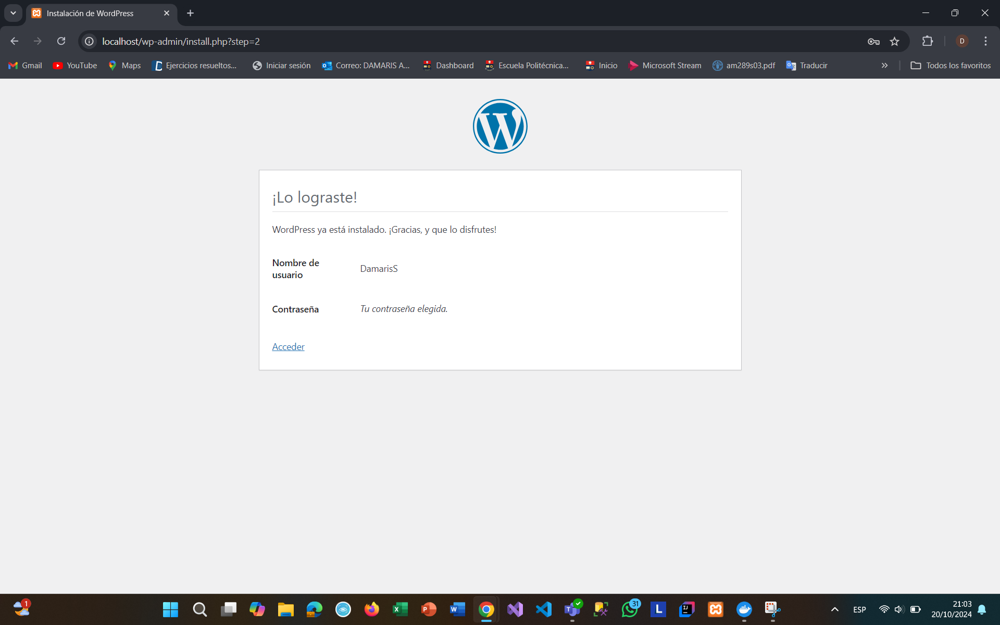
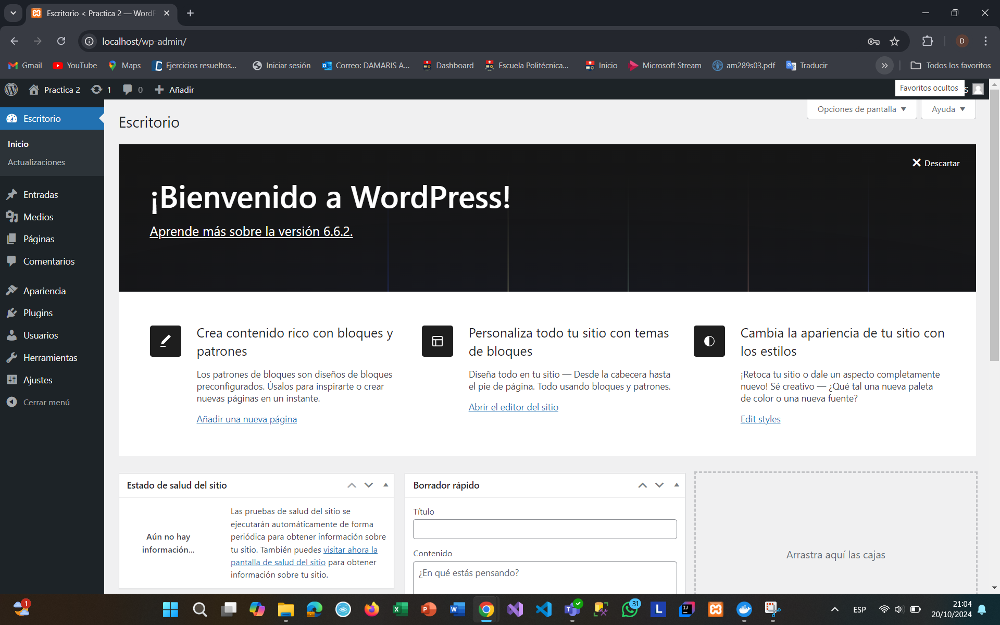
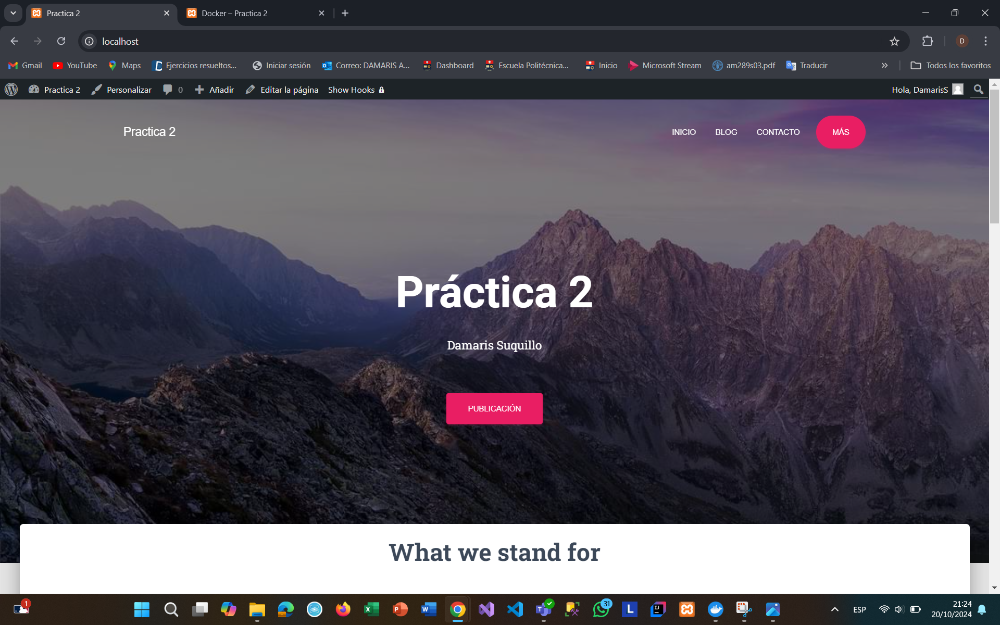
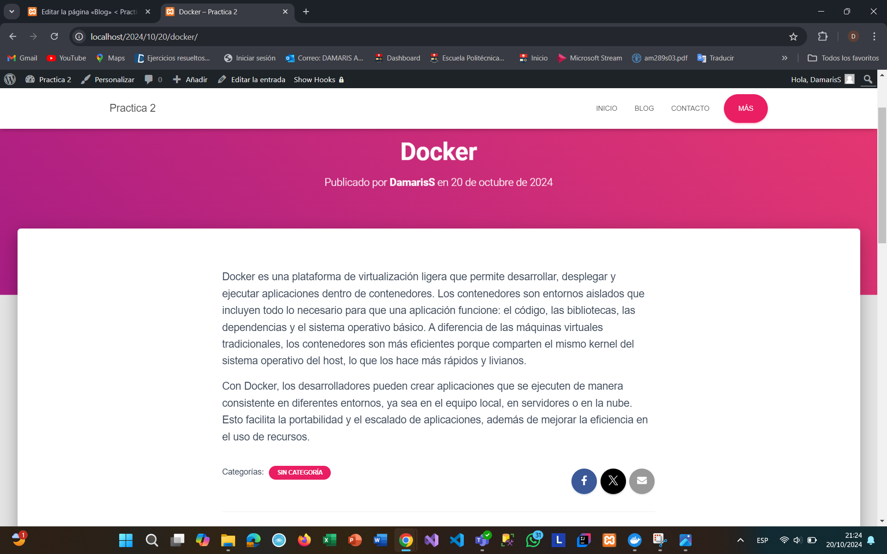

## Esquema para el ejercicio


### Crear la red
```
docker network create net-wp
```

### Crear el contenedor mysql a partir de la imagen mysql:8, configurar las variables de entorno necesarias
```
docker run -d --name mysql --network net-wp -e MYSQL_ROOT_PASSWORD=root_password -e MYSQL_DATABASE=wordpress_db mysql:8
```

### Crear el contenedor wordpress a partir de la imagen: wordpress, configurar las variables de entorno necesarias
```
docker run -d --name wordpress --network net-wp -e WORDPRESS_DB_HOST=mysql:3306 -e WORDPRESS_DB_NAME=wordpress_db -e WORDPRESS_DB_USER=root -e WORDPRESS_DB_PASSWORD=root_password -p 80:80 wordpress
```

De acuerdo con el trabajo realizado, en la el esquema de ejercicio el puerto a es **(80)**

Ingresar desde el navegador al wordpress y finalizar la configuración de instalación.






Desde el panel de admin: cambiar el tema y crear una nueva publicación.
Ingresar a: http://localhost:9300/ 
recordar que a es el puerto que usó para el mapeo con wordpress



### Eliminar el contenedor wordpress
```
docker rm wordpress
```

### Crear nuevamente el contenedor wordpress
Ingresar a: http://localhost:9300/ 
recordar que a es el puerto que usó para el mapeo con wordpress

### ¿Qué ha sucedido, qué puede observar?
# COMPLETAR


